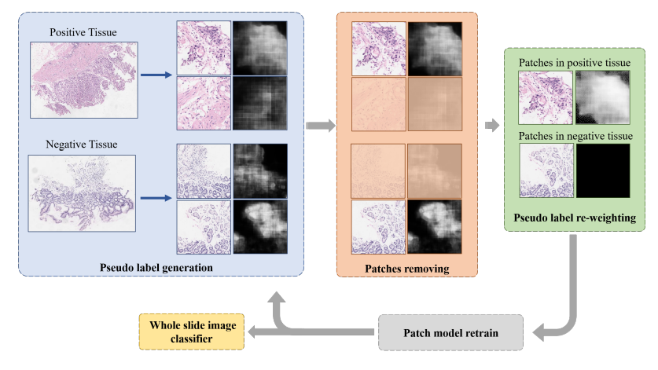
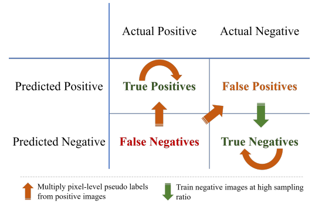
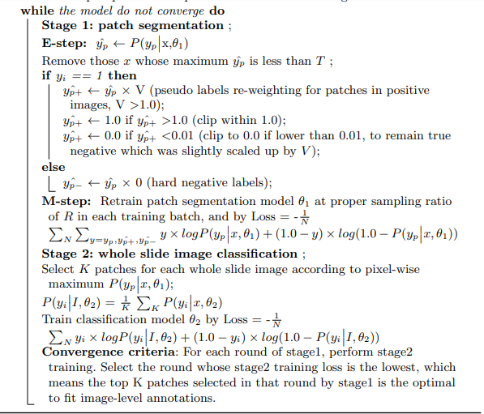

# Hybrid Supervision Learning for Pathology Whole Slide Image Classification

This is the code of 
Hybrid Supervision Learning for Pathology Whole Slide Image Classification, Sensetime Research, accepted in MICCAI2021.
Jiahui Li, Wen Chen, Xiaodi Huang, Shuang Yang, Zhiqiang Hu, Qi Duan, Dimitris N. Metaxas, Hongsheng Li and Shaoting Zhang

## Description

Hybrid supervision learning in computational pathology is a difficult task for this reason:
High resolution of whole slide images makes it difficult to do end-to-end
classification model training. To handle this problem, we
propose a hybrid supervision learning framework for this kind of high resolution images with sufficient image-level coarse annotations and a few
pixel-level fine labels. This framework, when applied in training patch
model, can carefully make use of coarse image-level labels to refine generated pixel-level pseudo labels. Complete strategy is proposed to suppress
pixel-level false positives and false negatives.

This code need to run third times to ensemble pixel-level prediction, then run stage2 to 
get 0.9243, 4th in Camelyon17 challenge, the submission.csv is my submission file.  
(https://camelyon17.grand-challenge.org/evaluation/challenge/leaderboard/)

## Getting Started

### Dependencies

* I have a GPU cluster, using 'srun python' to submit task. Modify code in orders/ to fit your machine.
* Pytorch, opencv, numpy, scikit-learn, scikit-image, PIL. 

### Installing

* 'pip install' all those packages 

### Executing program

* 1,  Replace paths of your whole slide images in 'data/wsi_and_anno/train_pos_1_wsi.txt' et al.
* 2,  Firstly go to data/, 'python crop_segmentation.py' to generate finegrain pixel labels from xmls.
* 3,  'python orders/Stage1_M_step_init.py' to train initial models.
* 4,  'python orders/Stage1_E_step_init_generate_pseudo_label.py' to generate pseudo labels for all whole slide images.
* 5,  'python oswalk.py' to generate paths indexes, replace keys.
* 6,  Repeat step 3~5 from 'init' to 'round3'
* 7,  'python orders/Stage1_E_step_round3_generate_pseudo_label_for_testdata.py' to generate pseudo labels for all whole slide images.
* 8,  'python Stage2_classification_generate_heatmap.py' to generate down sampled heatmaps.
* 9,  Ensemble heatmaps from several trails.
* 10, 'python Stage2_classifier.py' to generate submission file from ensembled heatmaps.
* 11, Hyperparameters ( T, V, K, R ) are directly written in dataloader.py and Stage1_E_step_generate_pseudo_label.py.

## Authors

Contributors names and contact info

Jiahui Li, lijiahui@sensetime.com or jarveelee@gmail.com

## Version History

* 0.1
    * Initial Release

## Acknowledgments
* [Deep Layer Aggregation](https://github.com/ucbdrive/dla)

